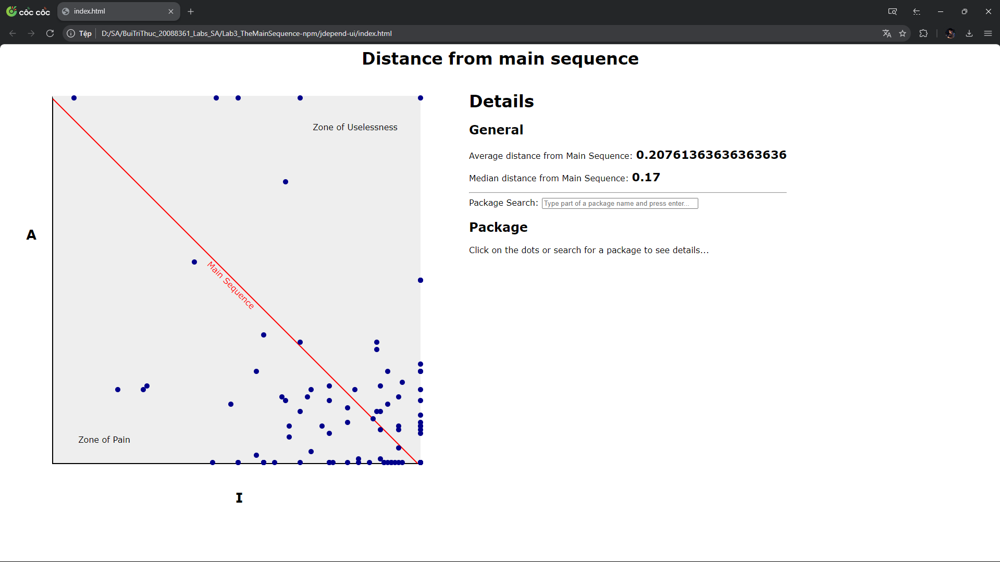

# Lab 02 : JavaParser
## Description
    - This lab is about parsing java files and extracting information from them.
## Installation
    - Clone the repository
    - Open the project in IntelliJ IDEA
    - Run the project on the main class
## Usage
    - Run the project and provide the path of the java file you want to parse.
## Output
    - The output will be the following:
        - The name of the class
        - The name of the methods
        - The name of the variables
        - The name of the constructors
        - The name of the interfaces
        - The name of the packages
    - example:

# Lab 03 : Main Sequence
## Description
    - This lab is about parsing java project and anylizing the main sequence of the project.
## Installation
    - Clone the this repository and the Lab03_TheManiSequence-npm repository
    - Open the project in IntelliJ IDEA
    - Run the project on the SwingUiMain class
## Usage
    - Run the project and provide the path of the java project you want to parse.
    - The project will parse the project and display the main sequence of the project in the index.html file.
## Output
    - The output will be the following:
        - The main sequence of the project and show the main sequence in the index.html file.
    - example:
### Aynlizing the project on Jdepend Swing UI :

### Aynlizing the project on Jdepend export xml and show the main sequence in the index.html file :

### index.html file :

# Lab 05 : ActiveMQ and JMS
## Description
    - This lab is about using ActiveMQ and JMS to send and receive messages.
## Installation
    - Clone the this repository
    - download the ActiveMQ from the following link : https://activemq.apache.org/components/classic/download/
    - Open the project in IntelliJ IDEA
    - Run the project on the main class
## Usage
    - Run ActiveMQ server
    - Run the project with Gradle
    - Test with Postman

# Lab 06 : Service Base Architecture
## Description
    - This lab is about creating a service base architecture using Spring Boot.
## Installation
    - Clone the this repository
    - Open the project in IntelliJ IDEA
    - Run the project on the main class
## Usage
    - Run the project with Gradle
    - Test with Postman

